## 🚢 What is Kubernetes (K8s)?

Kubernetes is an **open-source container orchestration platform** that automates the deployment, scaling, and management of containerized applications. It provides a robust framework for running distributed systems resiliently, allowing developers to focus on writing code without worrying about the underlying infrastructure.

## ✨ Key Features of Kubernetes

- 🚀 **Automated Deployment**: Kubernetes automates the deployment of applications, ensuring that the desired state is maintained.
- 📈 **Scaling**: It can automatically scale applications up or down based on demand, ensuring optimal resource utilization.
- 🔧 **Self-Healing**: Kubernetes can automatically replace or reschedule containers that fail, ensuring high availability.
- 🔍 **Service Discovery and Load Balancing**: Kubernetes provides built-in service discovery and load balancing, making it easy to expose applications to users.
- 🛡️ **Disaster Recovery**: It supports rolling updates and rollbacks, allowing for safe application updates without downtime.

## 🏗️ Kubernetes Architecture

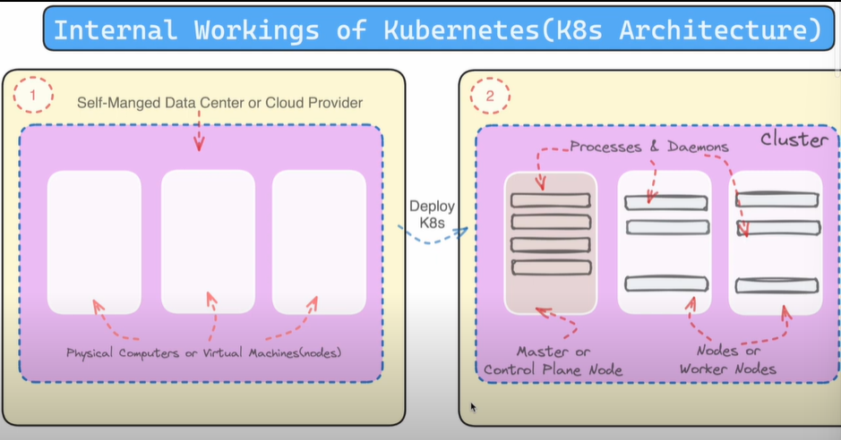

### 🏢 Core Components

- 🖥️ **Node**: A worker machine in Kubernetes, which can be a physical or virtual machine. Each node runs pods.
- 🏘️ **Cluster**: A set of nodes (machines) that run containerized applications managed by Kubernetes.
- 📦 **Pod**: The smallest deployable unit in Kubernetes, which can contain one or more containers.
- 👑 **Master Node**: The control plane that manages the Kubernetes cluster, responsible for making global decisions about the cluster (e.g., scheduling).
- 🏭 **Worker Node**: Nodes that run the applications and workloads. They are managed by the master node. (containers run here)

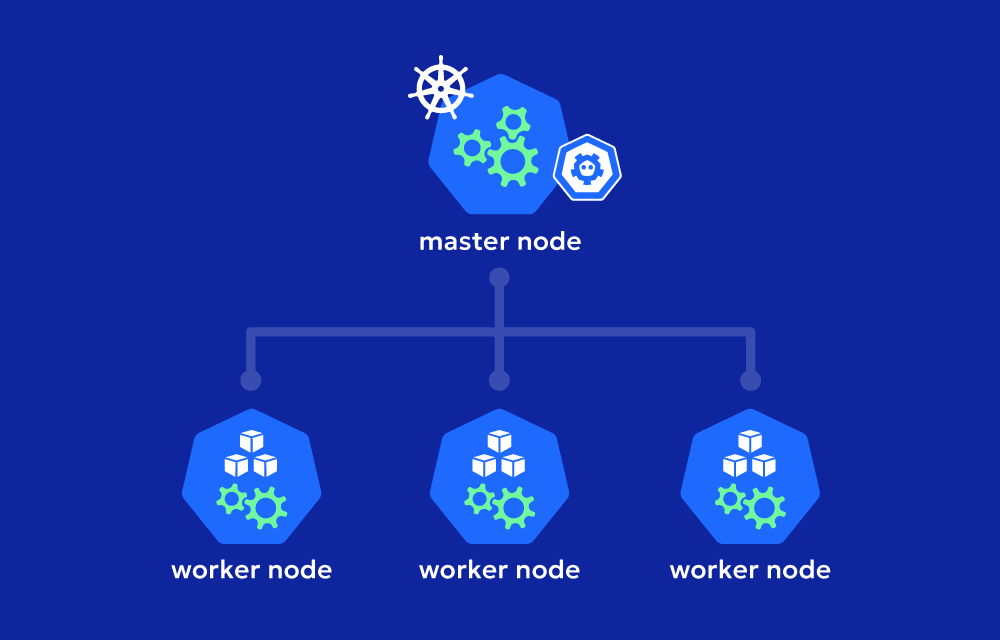

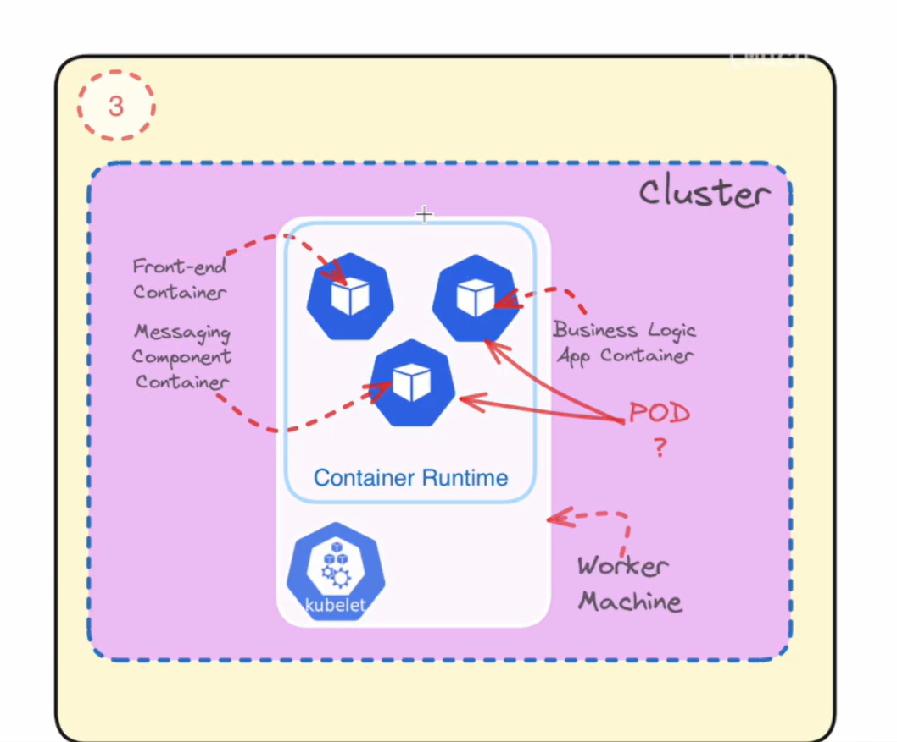

### 🔧 Worker Node Components

- 🤖 **Kubelet**: An agent that runs on each worker node, ensuring that containers are running in a pod as expected.

- 🐳 **Container Runtime**: The software responsible for running containers. Kubernetes supports various container runtimes like Docker, containerd, and CRI-O.

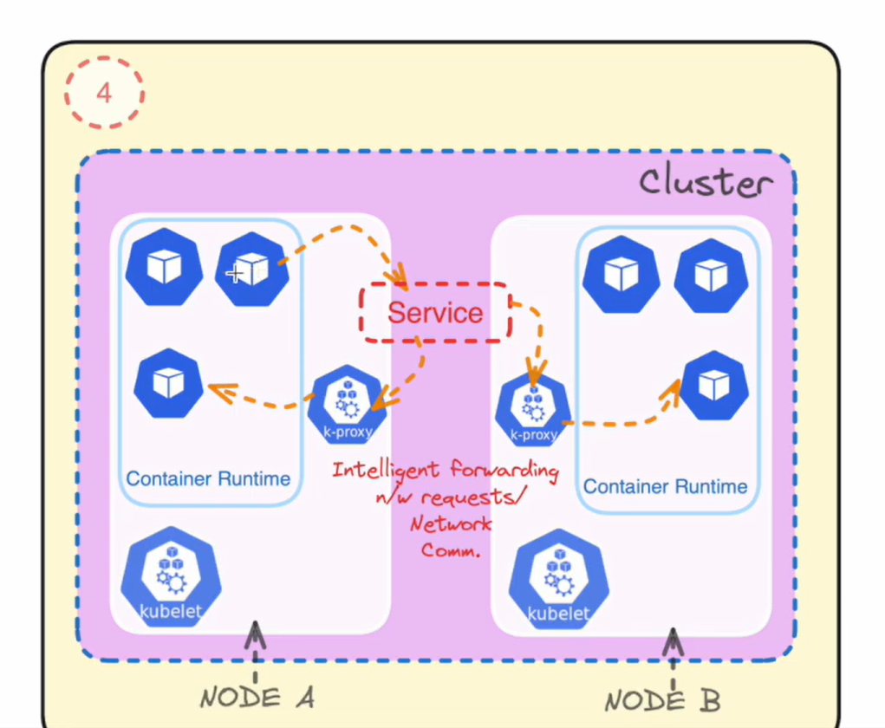

- 🌐 **kube-proxy**: A network proxy that runs on each node, allowing communication between the pods.
  - 💡 **Use case**: If we have two nodes, Node A and Node B, and a pod on Node A needs to communicate with a pod on Node B, kube-proxy ensures that the traffic is correctly routed between these nodes.

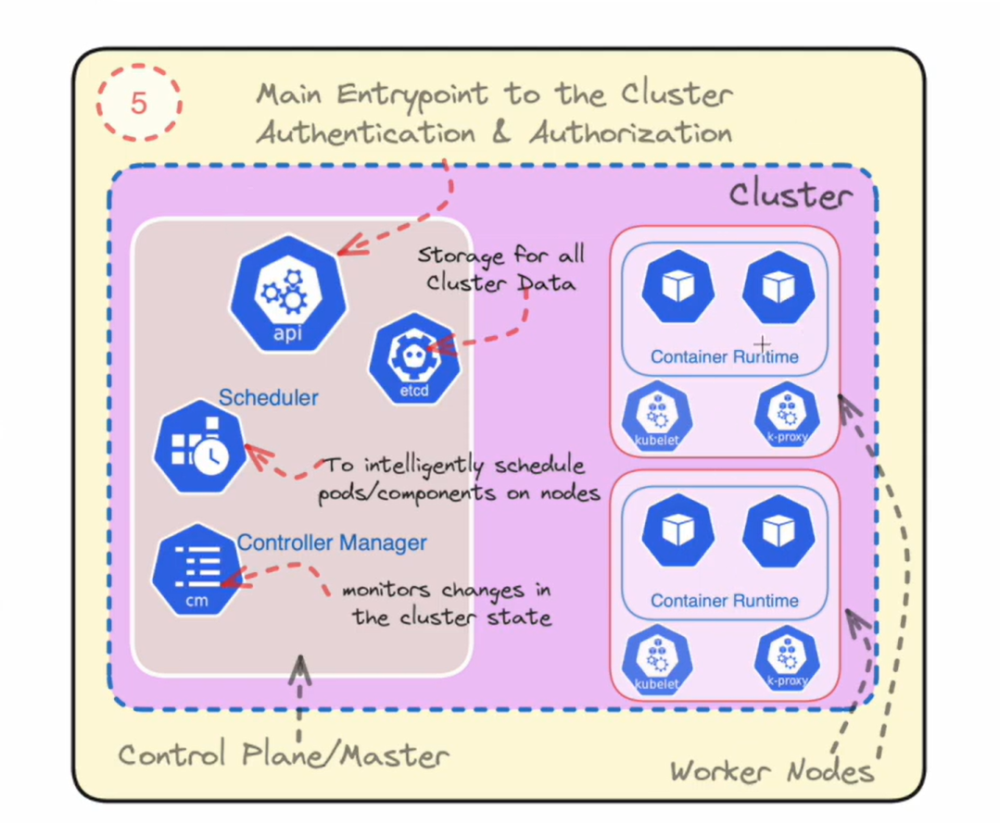

### 👑 Master Node Components

- 🎯 **API Server**: This is a process that runs in the master node.
  - It exposes the Kubernetes API, which is used by users and components to interact with the cluster.
  - The API server is the central management entity that receives commands and queries from users and other components.

- 📅 **Scheduler**: The scheduler is responsible for assigning pods to nodes based on resource availability and other constraints.

- 🎮 **Controller Manager**: This component runs controller processes that handle routine tasks in the cluster, such as managing the lifecycle of pods, nodes, and other resources.
  - It monitors the state of the cluster and makes adjustments as needed to maintain the desired state.
  
- 💾 **etcd**: A data store that holds the configuration data and state of the Kubernetes cluster. It is a key-value store used for storing all cluster data, including information about nodes, pods, and services.

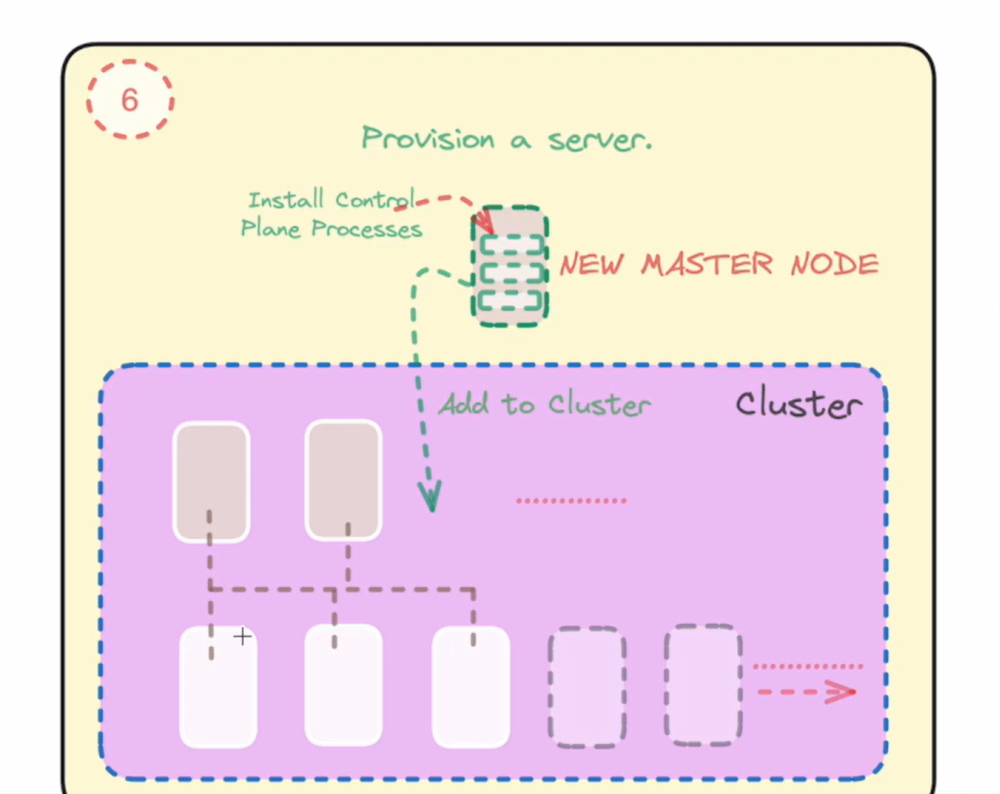

### 📋 Component Summary

#### 👑 Master Node Components
  - 🎯 API Server
  - 📅 Scheduler
  - 🎮 Controller Manager
  - 💾 etcd

#### 🏭 Worker Node Components
  - 🤖 Kubelet
  - 🌐 Kube-Proxy
  - 🐳 Container Runtime

## 🚀 Creating a New Container in Kubernetes

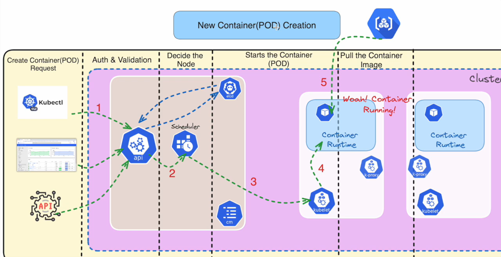

When a user wants to create a new container in Kubernetes, the process typically follows these steps:

1. 👤 A user sends a request to the `API server` to create a new container.
2. ✅ The `API server` validates the request and stores the desired state in `etcd`.
3. 📍 The `Scheduler` assigns the pod to a suitable worker node.
4. 🏃 The `Kubelet` on the worker node and starts the container runtime.
5. 🐳 The container runtime pulls the necessary container image and starts the container.

## 🔄 Recovering from a Failed Container

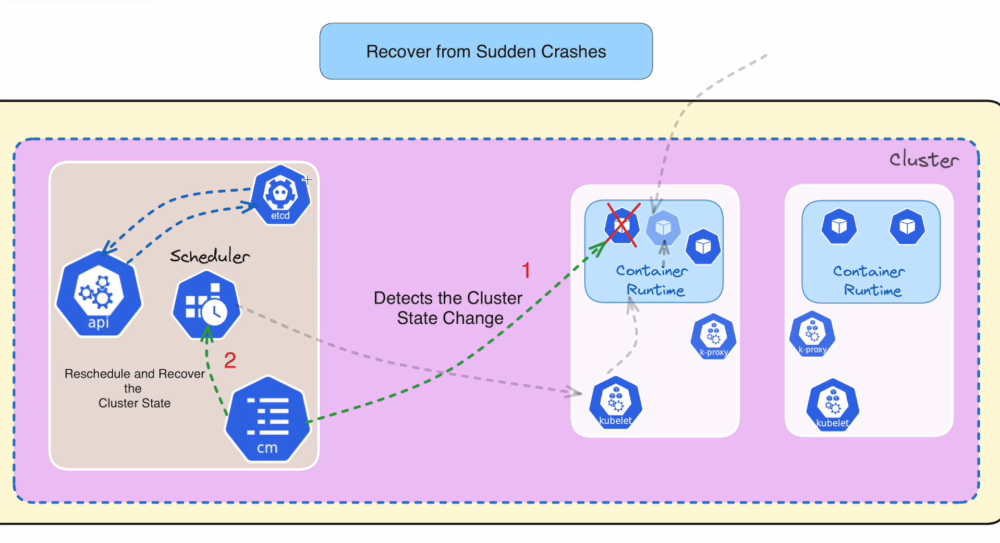

When a container fails, Kubernetes automatically takes steps to recover:

1. 🔍 The `Controller Manager` detects the failure by monitoring the state of the pods.
2. 📝 It updates the desired state in `etcd` to reflect that the container is no longer running.
3. 🎯 The `Scheduler` finds a new node (if necessary) and assigns a new pod to replace the failed one.
4. 🚀 The `Kubelet` on the worker node starts the new container using the container runtime.

## 🧩 Objects in Kubernetes

### 📦 Pods

A **pod** is the smallest deployable unit in Kubernetes, which can contain one or more containers. Pods share the same network namespace and can communicate with each other. They are typically used to run a single instance of an application or service.

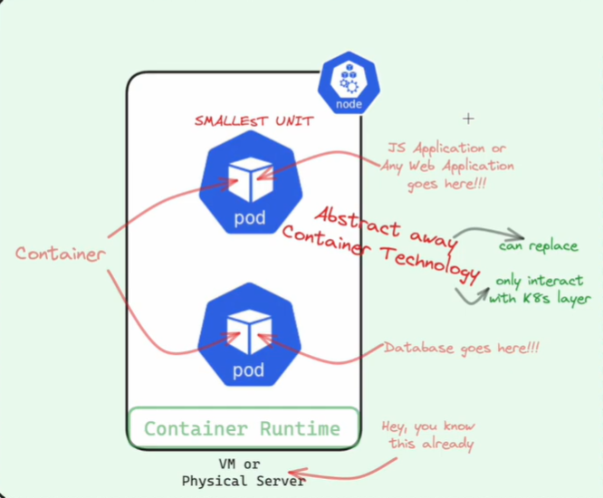

- 🤝 **Helper Container**: A container that assists the main application container in a pod. It can perform tasks such as data processing, logging, or monitoring.

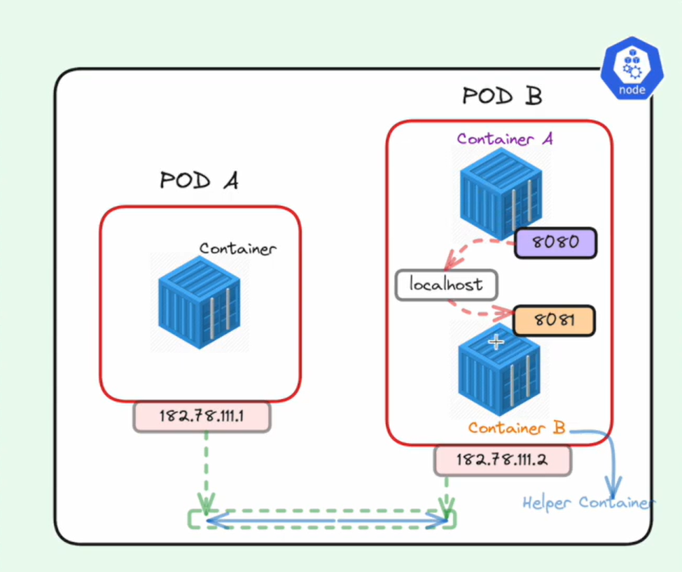

> 💡 **Key Point**: Each pod has a unique IP address, and containers within a pod can communicate with each other using `localhost`. Pods can also be exposed to the outside world through services.

### Services

A service in Kubernetes is an abstraction that defines a logical set of pods and a policy to access them. It provides a stable endpoint for accessing the pods, allowing for load balancing and service discovery.

Each service is assigned a unique IP address and DNS name, which can be used by other pods or external clients to access the service.

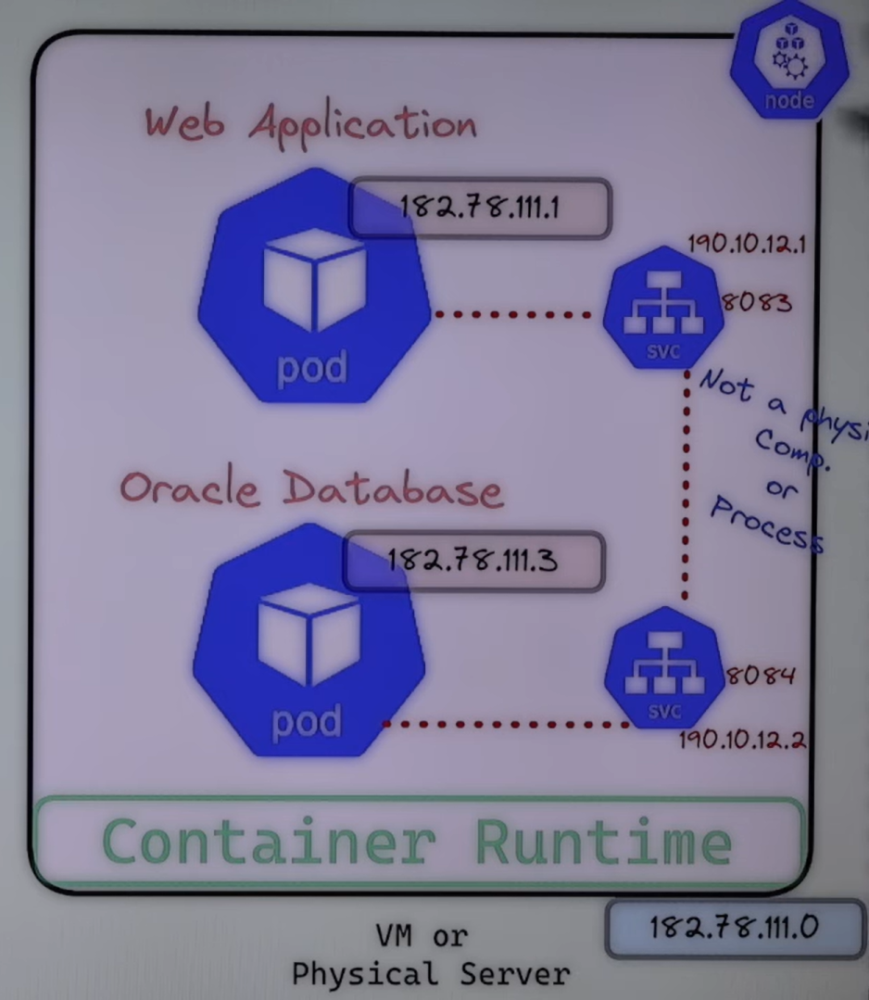

Web Application will call the ip of the database service (190.10.12.2) to access the database.

### Ingress

An Ingress provides HTTP and HTTPS routing to services based on defined rules. It acts as a reverse proxy, allowing external traffic to access services within the cluster without exposing each service individually.

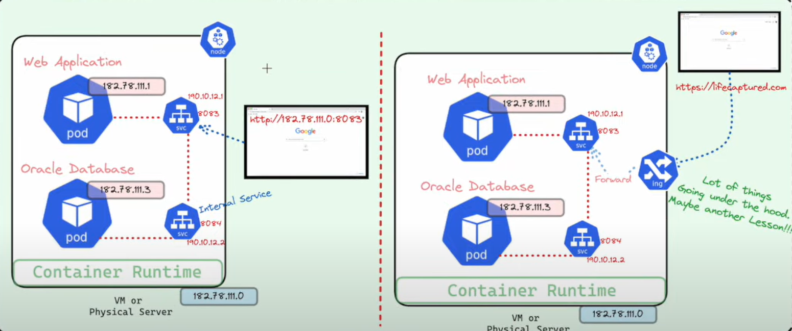

### ConfigMaps

ConfigMaps allow you to store and manage configuration data for your applications. They provide a way to decouple configuration artifacts from image content to keep containerized applications portable.

We do not put sensitive information in ConfigMaps, as they are not encrypted and can be accessed by anyone with access to the Kubernetes API.

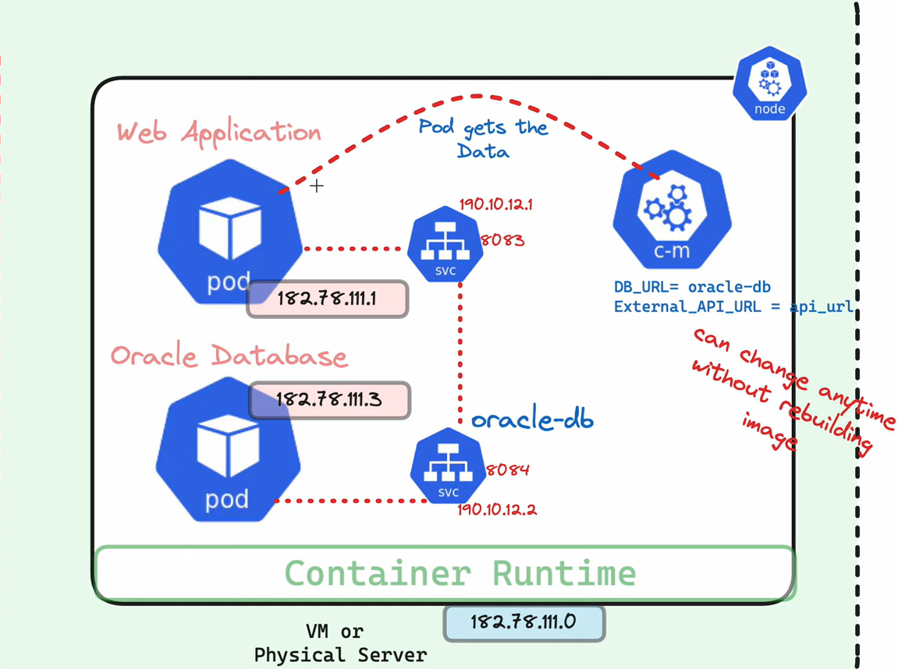

### Secrets

Secrets are used to store sensitive information, such as passwords, OAuth tokens, and SSH keys. They provide a secure way to manage sensitive data in Kubernetes without exposing it in plain text.

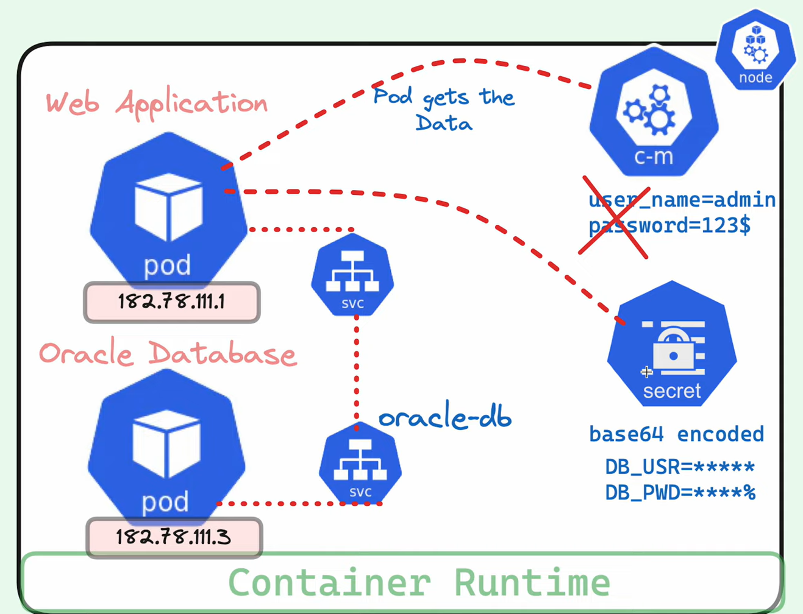

### Volumes

Volumes in Kubernetes provide a way to persist data beyond the lifecycle of a pod. They can be used to store data that needs to be shared between containers or to retain data even if the pod is deleted.

We can connect local storage or cloud storage to a pod using volumes.

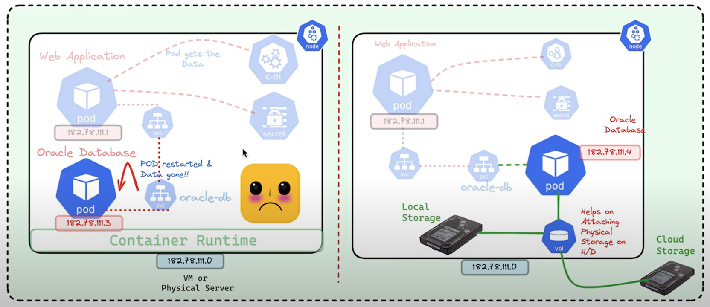

### Replica Sets

If a pod fails, the ReplicaSet automatically creates a new pod to replace it, ensuring that the desired number of replicas is always maintained.

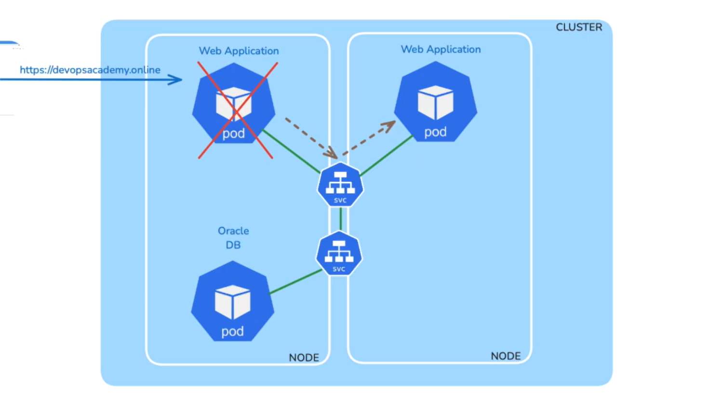

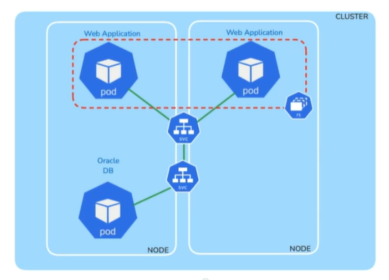

### Deployments

Deployments are a higher-level abstraction that manages ReplicaSets and provides declarative updates to applications. 

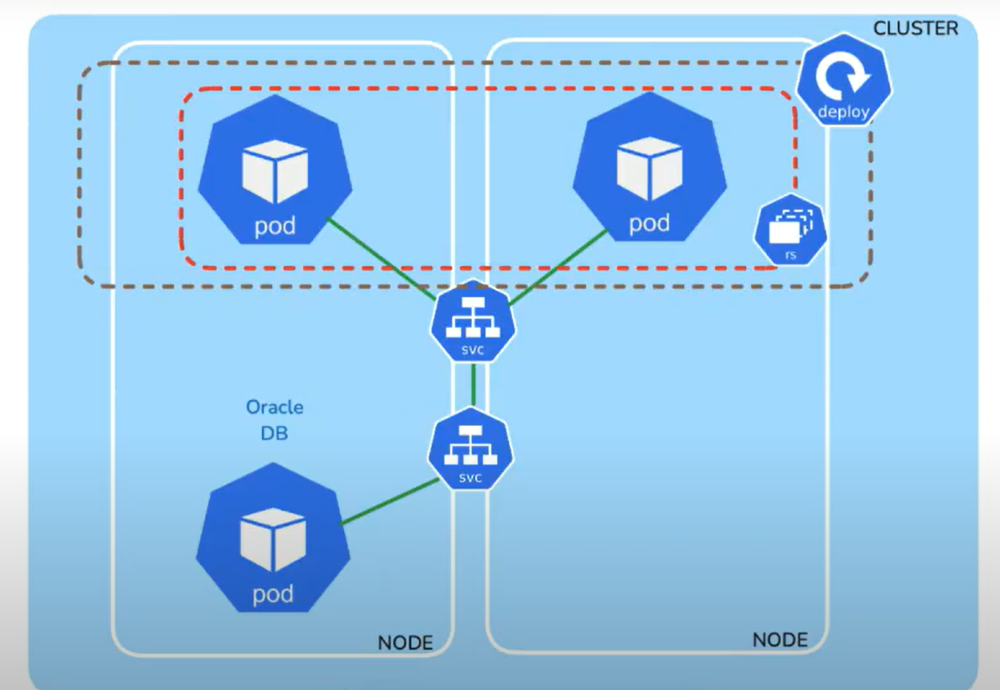

### Stateful Sets

StatefulSets are used to manage stateful applications that require stable network identities and persistent storage (e.g., databases). 

We cannot use replica sets for stateful applications, as they do not guarantee the order of pod creation or deletion.

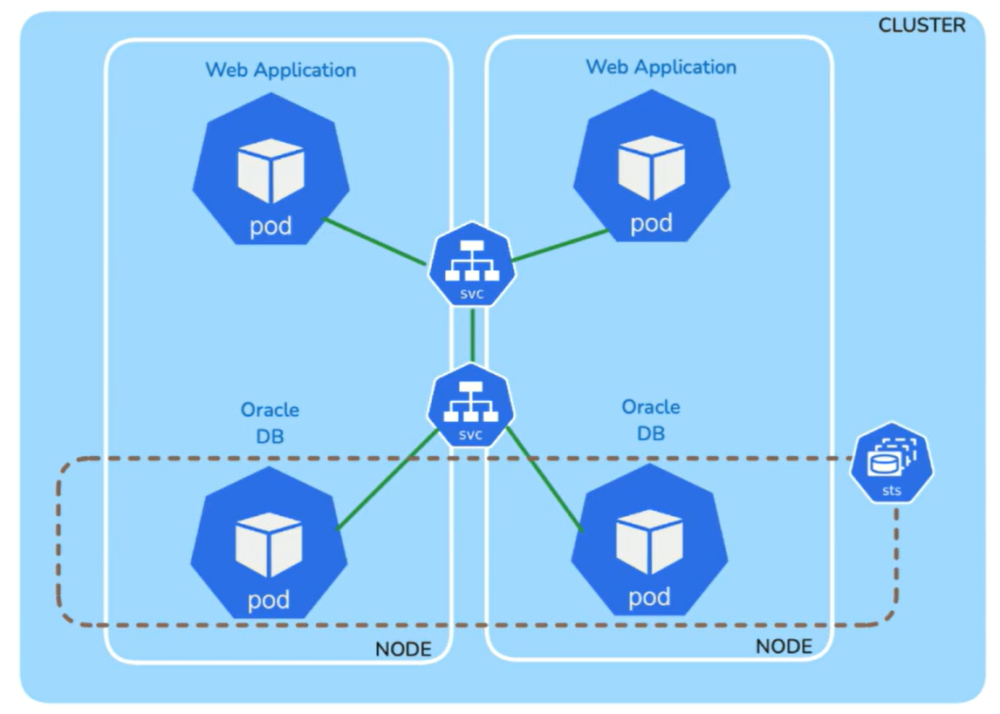

